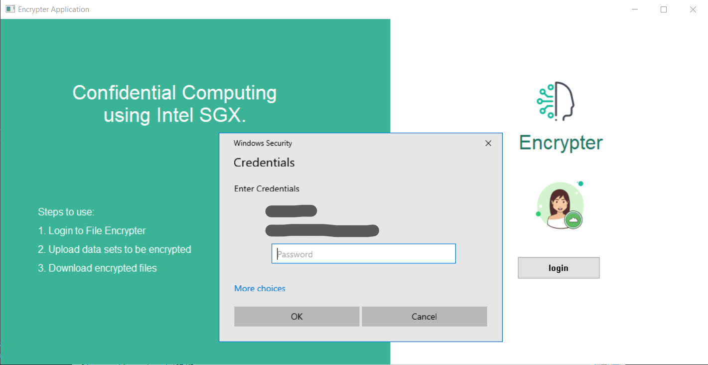
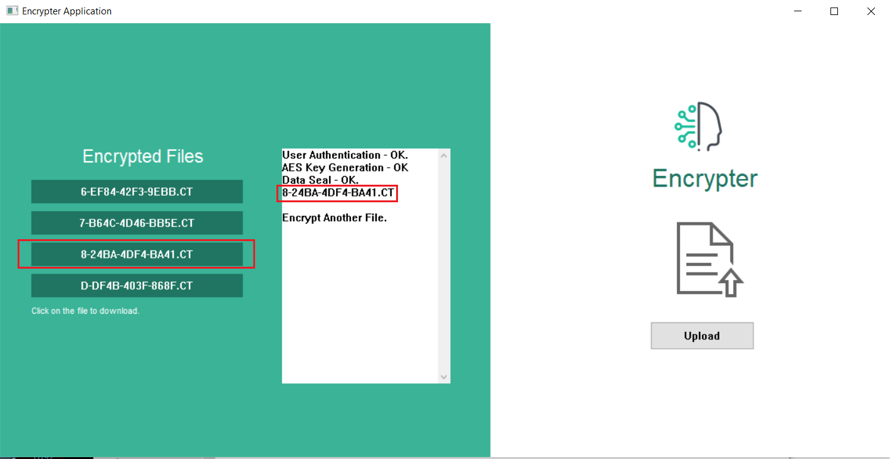
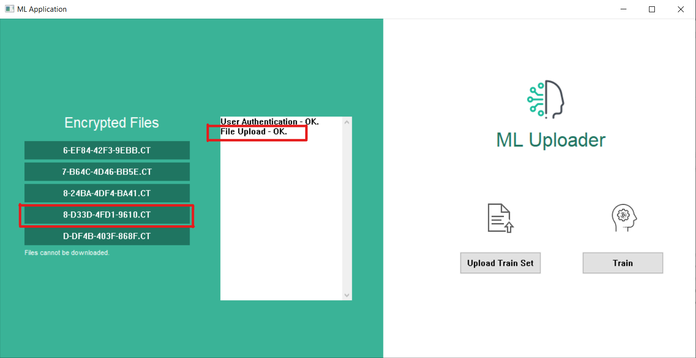
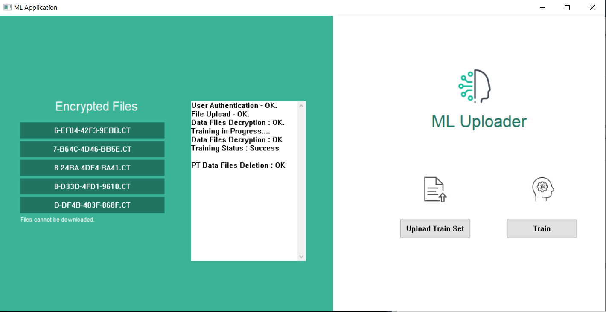

![c++][c++-shield] ![win32][win32] ![win32][sgx-shield]
<!-- PROJECT LOGO -->
<br />
<p align="center">
  <a href="https://github.com/othneildrew/Best-README-Template">
    
  </a>

  <h3 align="center">Confidential Computing of Machine Learning using Intel SGX</h3>

  <p align="center">
    Master's Thesis
    <br />
    <br />
    <br />
    <a href="https://github.com/prasadkjose/Confidential_ML_SGX/tree/master/screen-recordings">View Demo</a>
    ·
    <a href="https://github.com/prasadkjose/Confidential_ML_SGX/issues">Report Bug</a>
    
  </p>
</p>

<!-- TABLE OF CONTENTS -->

## Table of Contents

- [About the Project](#about-the-project)
  - [Built With](#built-with)
- [Getting Started](#getting-started)
  - [Prerequisites](#prerequisites)
  - [Installation](#installation)

<!-- ABOUT THE PROJECT -->

## About The Project

<!-- [![Product Name Screen Shot][product-screenshot]](https://example.com) -->

A TEE-based application to securely upload and train multiparty data-sets with confidential computing.

[Thesis reprort](Master_Thesis.pdf)

### Built With

This platform was built with

- [c++](https://www.cplusplus.com)
- [WinAPI](https://docs.microsoft.com/en-us/windows/win32/)
- [Intel SGX](https://software.intel.com/content/www/us/en/develop/topics/software-guard-extensions.html)

<!-- GETTING STARTED -->

## Getting Started

Steps to run the software locally

### Prerequisites

- Intel SGX capable systems or Visual Studio 2017 with Intel SGX SDK
- Microsoft Windows 10 64-bit for Intel SGX support
- Intel processor that supports Intel
  Data Protection Technology(DPT) with Secure Key

### Installation

1. Install Visual Studio 2017 along with Intel SGX SDK
2. Clone the repo

```sh
git clone https://github.com/prasadkjose/Confidential_ML_SGX.git
```

3. Import the project in Visual Studio.
4. Run the application in debug mode or simulation mode.

<!-- USAGE EXAMPLES -->

## Usage

There are two applications

- Encrypter

  - Open the Encrypter application
    <p align="center">
     
    </p>

  - Login
     <p align="center">
     
    </p>
  - Upload the Datasets
    <p align="center">
     
    </p>

  - Once the files are uploaded, they can be viewed in the console and also listed under "Encrypted Files"
    <p align="center">
       
    </p>

* ML Uploader

  - Open the ML Uploader application.
    <p align="center">
      
    </p>
  - Log in and upload the datasets.
    <p align="center">
      
    </p>

  - Click Train to train the model
    <p align="center">
      
    </p>

  <!-- MARKDOWN LINKS & IMAGES -->
  <!-- https://www.markdownguide.org/basic-syntax/#reference-style-links -->

[c++-shield]: https://img.shields.io/badge/C%2B%2B-17-brightgreen
[win32]: https://img.shields.io/badge/Windows-10-blue
[sgx-shield]:https://img.shields.io/badge/Intel%20SGX--blue

[encrypter1]: Screenshots/EncrypterHome.png
[thesis]: Master_Thesis.pdf
